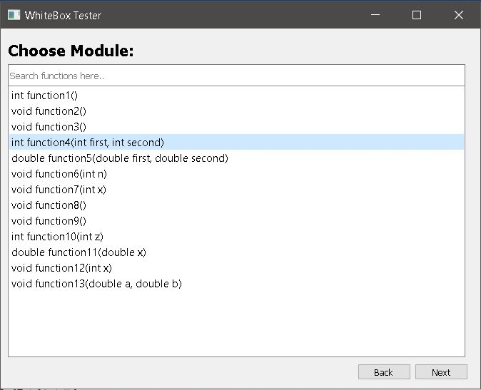

## ADE-TestBot: A White Box Testing Tool

> NOTE: Due to Git LFS not allowing individual file sizes over 100MB to be uploaded, I have uploaded the entire code as a .zip file. Your first step should be to unzip it.

## Intro
The human dependency on computing technology is increasing exponentially, ranging
from simple house hold chores to safety and mission critical tasks involving domains
like healthcare, transportation and banking. Thus, it is becoming increasingly important
that these softwares running on computers work without any major flaws.

Software testing is used to ensure an error free completion of the tasks performed by a software.

ADE Testbot is a white box testing tool that is capable of performing dead code, exception and assertion testing of a C++ software under
test (SUT). Other unique features of the testing tool include an easy to use graphical user interface (GUI) and its open-source nature.

## Methodology

## Supported function return types
```
int
bool
double
float
```
## Requirements
- Visual Studio 2017 (https://visualstudio.microsoft.com/downloads/)  
- Qt 5.6 or Qt 5.7 (https://download.qt.io/archive/qt/5.7/5.7.0/)
- Qt Visual Studio tools extension (https://marketplace.visualstudio.com/items?itemName=TheQtCompany.QtVisualStudioTools-19123)
## Project Demo (Performing Exception Test on C++ module)

## Screen 2

## Screen 3

## Screen 4

## Screen 5


